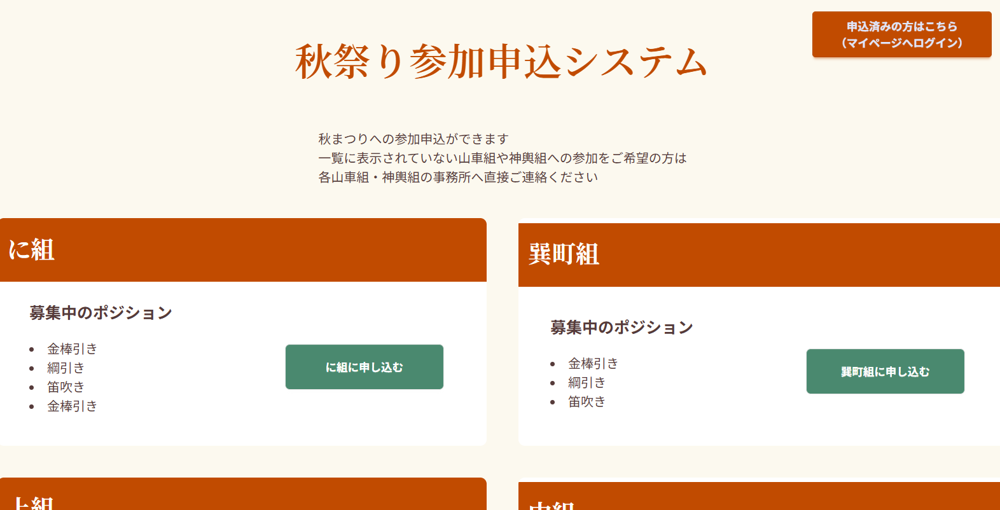
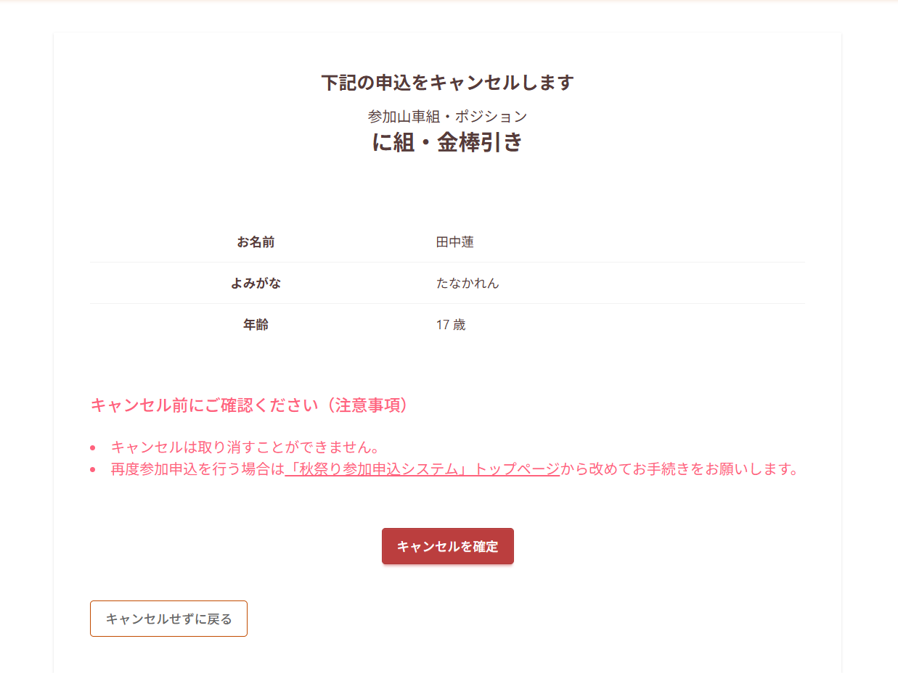
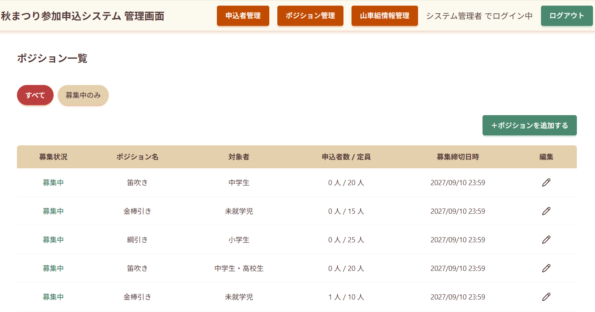
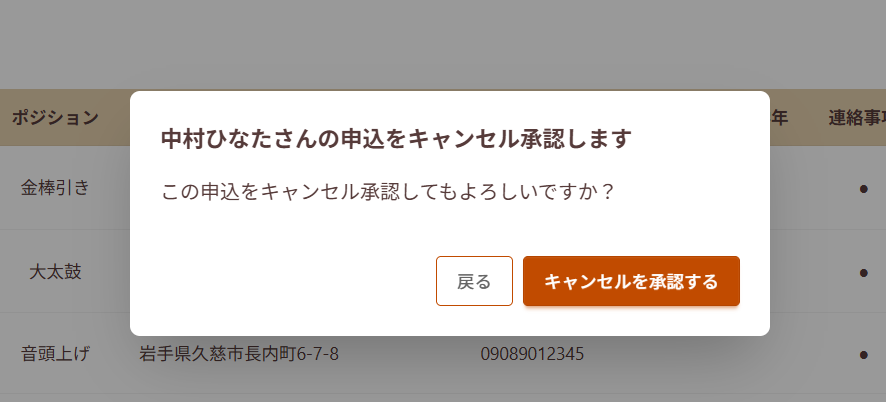
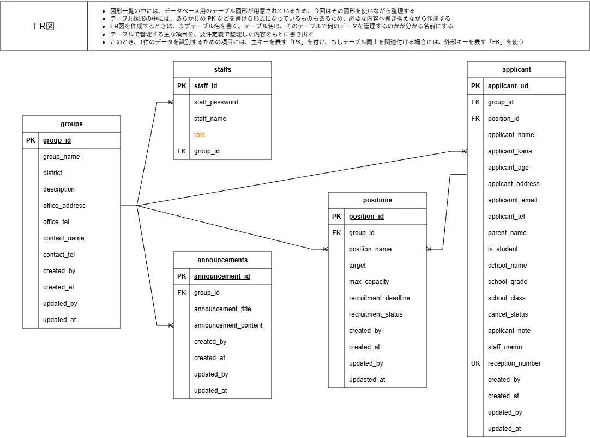

# 秋祭り参加申込システム
地域の秋まつりへの参加申込をオンラインで一元管理。  
参加者と運営側双方の負担を軽減するためのWebアプリケーション

## アプリケーション概要
本システムでは、以下を目的としています。

- 山車組ごとの参加申込をWeb上で受け付ける
- 参加者がマイページから自身の申込情報を確認・編集できるようにする
- キャンセル依頼をWebから行えるようにする
- 山車組の担当者が、所属する山車組の参加者情報を管理できるようにする
- 特権管理者が複数の山車組の情報をまとめて管理できるようにする
- 参加者情報をデータベースで一元管理し、紙や個別のフォームに依存した情報管理を減らす

### アプリケーションURL
[アプリケーションはこちら](https://autumn-festival-app.onrender.com/)

## 開発背景
職業訓練の修了時期が迫り、修了制作に何をつくろうか考え始めたのが  
ちょうど地元の秋まつり参加者募集が開始される時期でした。

実際にどのような申込方法になっているのかを調べてみると、  
山車組によってまちまちで、中には申込書を窓口に取りに行き  
記入してまた提出しに行って…というところもまだまだあるようでした。

山車の運行は未就学児から中学生・高校生が中心となるため、  
働いていらっしゃる親御さんにとっては申込も大変そう。

また、地元の秋まつりは複数日にわたって開催され、平日も含まれるため  
学校側でも誰が参加するのかを把握しておく必要があると考えました。

申込から各学校への報告、マイページでの一斉連絡などをWebシステムでまとめて管理することで  
参加する側も運営側も負担を減らすことができるシステムを作りたい！という思いから
今回の開発に繋がりました。

単なる入力フォームではなく、参加者のマイページ、申込情報の編集、キャンセル依頼、
山車組担当者による参加者管理、特権管理者による全体管理など、実際の運用を想定した機能を実装しています。

## 主な機能
### 参加者向け
- 参加申込
- 申込内容の確認
- 申込情報の修正
- キャンセル申請
- メール通知（初回リリースには間に合いませんでした😿）

### 管理者（山車組の担当者など）向け
- 申込者一覧・検索
- 申込者情報の編集・削除
- 募集ポジションの登録・編集
- 募集状況・募集締切の管理
- キャンセル申請の承認
- 山車組ごとの権限管理

### 特権管理者（システム担当者・運営事務局など）向け
- すべての申込情報の一覧・検索
- 各山車組・各ポジションごとの参加申込状況確認

## 画面紹介  
### 参加申込ページ


各山車組ごとに募集中のポジションを表示
参加したいポジションが募集中かどうかを確認してから申込ができます  

  
### 参加者マイページ

申込済みの内容を確認・修正し、万が一参加出来なくなった場合もWeb上からキャンセル依頼ができます  
マイページへのログインは、登録した氏名・電話番号・一意の受付番号を使用しました  


### 管理画面  



山車組担当者は、所属する山車組の申込者情報を一覧で確認・管理できます。
申込者ごとのやりとりをメモとして残すことで、山車組内での情報伝達漏れを防ぎます。

電話などで参加希望を受け付けた場合には、山車組担当者が管理画面から  
申込情報を登録することもできます。

募集ポジション管理画面では、定員・締切日・募集状況を一目で確認できるようにしました。

特権管理者は、すべての山車組の申込情報を確認・管理できます。
また、募集ポジション管理画面では定員や締切日、募集状況を一目で確認できるようにしました。
山車組情報管理画面では、山車組事務所以外の窓口情報も登録できるようになっています。

## 使用技術

### フロントエンド
- React
- Vite
- Javascript
- Tailwind + DaisyUI

### バックエンド
- Java
- Spring Boot
- Spring Security
- Spring Data JPA
- Hibernate
- Flyway

### データベース
- PostgreSQL(リリース環境)
- H2(開発環境)

## ER図


## ローカル環境での起動方法  
### 必要環境  
- Docker Desktop
- Git  
- IDE（IntelliJ IDEA / VS Code / Eclipseなど)  
  
### インストール手順
1.リポジトリからクローン  
```bash
git clone https://github.com/hiro0320mm/autumn-festival-app.git  
cd autumn-festival-app 
```  

2.DockerでDBを起動  
Docker Desktopを起動した状態で、H2コンテナを起動します  
※データベースにPostgreSQLを使用する場合は、
`migration-postgresql` フォルダのマイグレーションファイルを使用してください。　　

```bash
docker compose up -d
```  

3.バックエンドを起動  
ターミナルでbackendディレクトリへ移動します  
```bash
cd backend
```  

4.Spring Bootを起動します  
IntelliJ IDEAからSpring Bootアプリケーションを起動します。
```bash
mvnw.cmd Spring-boot:run  
```
  
バックエンドは http://localhost:8080 で起動します  

5.フロントエンドを起動  
別のターミナルを開き、frontendディレクトリへ移動します  
```bash
cd frontend
```  

初回のみ依存関係をインストールします  
```bash
npm install  
```  

その後、開発サーバを起動します  
```bash
npm run dev  
```  

フロントエンドは http://localhost:5173 で起動します  

起動が完了したら、ブラウザで以下にアクセスしてください  
http://localhost:5173  

## 実装上の特徴

- 参加者向け画面と管理者向け画面を分離し、それぞれの利用目的に合わせたUIを設計
- 山車組担当者と特権管理者で操作可能な範囲を分け、山車組単位の権限管理を実装
- 募集ポジションごとに定員・募集締切・募集状況を管理
- キャンセルを即時削除ではなく「キャンセル申請 → 管理者承認」という流れにすることで、 運営側で状況を確認できるように設計
- 参加者自身が申込情報を確認・修正できるマイページを実装  
  

## 最後に  
初めてのJava、初めてのSpring Bootでの開発でしたので、おかしなところもたくさんあると思います。  
どうぞお手柔らかにお願いします！
